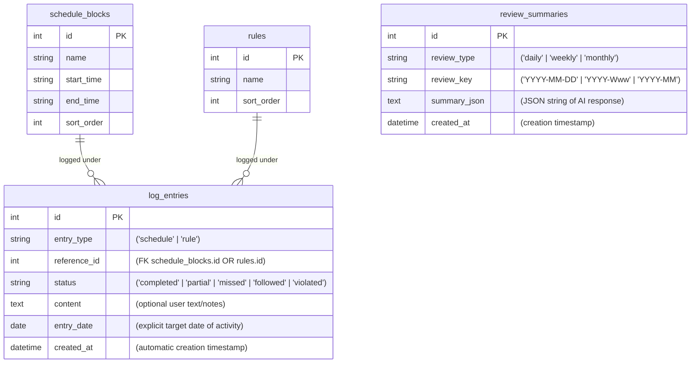

# 📓 Morpheus — Architecture & Design Documentation

Welcome to the **Morpheus** developer onboarding and architecture documentation. This document provides a complete guide to the project's codebase, data models, services, folder structures, and execution flows to enable any engineer to get started immediately without reading raw code.

---

## 🚀 1. Technology Stack

Morpheus is built with a lightweight, local-first stack designed for quick response times and zero dependencies:

- **Web Framework**: FastAPI (running on Uvicorn)
- **Database Engine**: SQLite (local database file `morpheus.db`)
- **Object-Relational Mapping (ORM)**: SQLAlchemy 2.0 (using type-annotated `Mapped` styles)
- **Template Engine**: Jinja2 (server-rendered HTML pages mounted by FastAPI)
- **Frontend / Styling**: Vanilla CSS (modern dark-theme layout with backdrop filters and custom cards)
- **AI / LLM Integration**: Google Gemini 2.0 (`google-genai` SDK)

---

## 📂 2. Directory Structure

The project has a clear separation of concerns, organized as follows:

```
Morpheus/
├── .env                         # Local configuration variables (ignored by git)
├── .env.example                 # Example template for setting up env
├── requirements.txt             # Python packages listing
├── morpheus.db                  # SQLite database file (auto-generated)
└── app/
    ├── main.py                  # App entrypoint, mounts static files/templates, registers routes
    ├── config/
    │   └── settings.py          # Configuration loading & validation using pydantic-settings
    ├── database/
    │   ├── __init__.py
    │   ├── base.py              # Declarative SQLAlchemy base
    │   ├── engine.py            # SQLite engine configuration, get_db dependency, table creator
    │   └── seed.py              # Default schedule blocks & rules seeding script (idempotent)
    ├── models/                  # SQLAlchemy ORM schemas
    │   ├── __init__.py          # Table registration imports
    │   ├── schedule_block.py    # Target schedule blocks (e.g. Sleep, Deep Work)
    │   ├── rule.py              # Predefined rules to check compliance
    │   ├── log_entry.py         # User-logged events (schedule statuses & rule checks)
    │   └── review_summary.py    # Cached AI-generated summary outputs
    ├── routes/                  # Route handlers (FastAPI routers)
    │   ├── health.py            # Healthcheck route (/health)
    │   ├── pages.py             # User logging pages, dashboard page, and submission routes
    │   └── reviews.py           # Review routes (/review/daily, /review/weekly, /review/monthly)
    ├── services/                # Business logic engines
    │   ├── __init__.py
    │   ├── schedule_service.py  # Schedule CRUD
    │   ├── rule_service.py      # Rule CRUD
    │   ├── log_service.py       # LogEntry persistence & retrievals
    │   ├── review_service.py    # Heavy date aggregation queries for reviews
    │   ├── review_payload_builder.py # Serializes review data into an LLM payload
    │   ├── ai_summary_service.py     # Cache checking, LLM payload orchestration, and caching
    │   └── llm/                 # LLM provider packages
    │       ├── __init__.py      # Provider Factory (lru_cached)
    │       ├── llm_base.py      # Abstract Base Class (ABC) contract
    │       └── gemini_provider.py # Gemini 2.0 concrete class using google-genai
    ├── static/
    │   └── css/
    │       └── style.css        # Custom styles for dark layout, layout grid, tables, and AI cards
    └── templates/               # Jinja2 layouts and pages
        ├── base.html            # Main site layout (sidebar, header, content containers)
        ├── dashboard.html       # Home page showing today's progress & logs list
        ├── log_schedule.html    # Form to submit a schedule block log
        ├── log_rule.html        # Form to submit a rule compliance check
        ├── review_daily.html    # Daily stats and blocks cards
        ├── review_weekly.html   # Weekly table aggregation with count pills
        ├── review_monthly.html  # Monthly table aggregation
        └── _ai_summary.html     # Reusable template partial showing Gemini summary responses
```

---

## 🗄️ 3. Database Schema

The SQLite schema consists of four tables. It is automatically initialized and seeded by calling `init_db()` and `seed_defaults()` in the application startup hooks.



### Table Definitions

#### A. `schedule_blocks`
Defines target time intervals for tracking. Seeded defaults include:
1. **Sleep** (10:00 PM - 6:00 AM)
2. **Jogging** (6:00 AM - 6:30 AM)
3. **Morning Routine** (6:30 AM - 7:00 AM)
4. **Morning Study** (7:00 AM - 7:50 AM)
5. **Travel + Breakfast** (7:50 AM - 8:45 AM)
6. **Office Morning Study** (8:45 AM - 10:40 AM)
7. **Deep Work** (10:40 AM - 1:00 PM)
8. **Lunch** (1:00 PM - 2:00 PM)
9. **Afternoon Work** (2:00 PM - 4:30 PM)
10. **Office Evening Study** (4:30 PM - 6:00 PM)
11. **Evening Routine** (6:00 PM - 8:00 PM)
12. **Night Study** (8:00 PM - 10:00 PM)

#### B. `rules`
Rules that the user evaluates compliance against:
1. **No Social Media**
2. **Study time >= 4 hours**
3. **Deep Work >= 2 hours**

#### C. `log_entries`
Stores individual log submissions. 
* ⚠️ **CRITICAL ASSUMPTION**: We filter and calculate reviews strictly using `entry_date` (the day the activity belongs to), *never* `created_at` (when it was typed). This allows users to back-log entries for the previous day.

#### D. `review_summaries`
A cache store for AI-generated review summaries. Has a unique constraint on `(review_type, review_key)` so that Gemini is called only once per period.

---

## ⚙️ 4. Backend Services & Logic

### A. Review Calculation (`app/services/review_service.py`)
Provides a core function `build_review(db, start_date, end_date)`.
- Fetches all schedule blocks and rules.
- Queries `log_entries` within the date range.
- Groups entries by `reference_id` (handling duplicate logs for the same block by selecting the most recent entry).
- Computes aggregate counts:
  - **Schedule Blocks**: counts of completed, partial, missed, and unlogged occurrences.
  - **Rules**: counts of followed, violated, and unlogged occurrences.
- Returns a structured `ReviewResult` dataclass.

### B. LLM Abstraction Layer (`app/services/llm/`)
Designed to switch providers seamlessly.
- [LLMProvider](file:///d:/PlayGround/Morpheus/app/services/llm/llm_base.py) defines the contract: `analyze_review(self, payload: dict) -> dict | None`
- [GeminiProvider](file:///d:/PlayGround/Morpheus/app/services/llm/gemini_provider.py) implements it using the unified `google-genai` SDK and the model `gemini-2.0-flash`.
- Uses Gemini's `response_schema` parameter with a Pydantic model (`ReviewAnalysis`) to enforce the exact JSON format returned.
- A factory method `get_llm_provider()` is used to resolve the provider. It returns `None` if `GEMINI_API_KEY` is not found, enabling graceful fallback degradation.

### C. AI Summary Orchestrator (`app/services/ai_summary_service.py`)
- First queries the `review_summaries` cache table.
- If cache hits, deserializes `summary_json` and returns it immediately.
- If cache misses, uses `review_payload_builder` to format the data, requests analysis from the LLM provider, saves the response to SQLite, and returns it.
- If there is zero data logged for that period, it skips calling the API entirely to prevent empty summaries.

---

## 🎨 5. Frontend & CSS Architecture

### Shell layout (`templates/base.html`)
Presents a standard app layout with a sticky header showing the app logo, current local date, a responsive left sidebar containing direct links to:
- **Logging forms** (individual blocks and rules)
- **Reviews** (Daily, Weekly, Monthly views)

### Stylesheet System (`static/css/style.css`)
- Styled using a **dark-mode first** theme:
  - Primary Background (`--color-bg`): HSL dark slate blue.
  - Cards & Sidebars (`--color-surface`): Elevated dark grey.
  - Accent Color (`--gradient-accent`): Warm amber-to-rose gradient.
- Semantic feedback borders/badge colors (success green, danger red, info blue, purple accent).
- Responsive breakdown using media queries for smaller devices.

### AI summary card layout (`templates/_ai_summary.html`)
If `ai_summary` context exists, it renders a glassmorphic container with:
- Top border purple accent gradient.
- Overall coach's assessment box.
- A responsive grid listing **Successes**, **Missed Opportunities**, **Patterns**, and **Recommendations** in color-coded cards.

---

## 🛠️ 6. Setup & Developer Quickstart

To run this application locally:

1. **Activate virtual environment**:
   ```bash
   venv\Scripts\activate
   ```
2. **Install dependencies**:
   ```bash
   pip install -r requirements.txt
   ```
3. **Configure environment settings**:
   Copy `.env.example` to `.env` and fill in your details:
   ```env
   GEMINI_API_KEY=AIzaSy... (Must be a personal Gmail key, Workspace keys with 0 limits fail)
   ```
4. **Start the server**:
   ```bash
   venv\Scripts\uvicorn.exe app.main:app --host 127.0.0.1 --port 8000 --reload
   ```
5. Navigate to `http://127.0.0.1:8000` in your web browser. Database tables and seed values will initialize automatically on startup.
