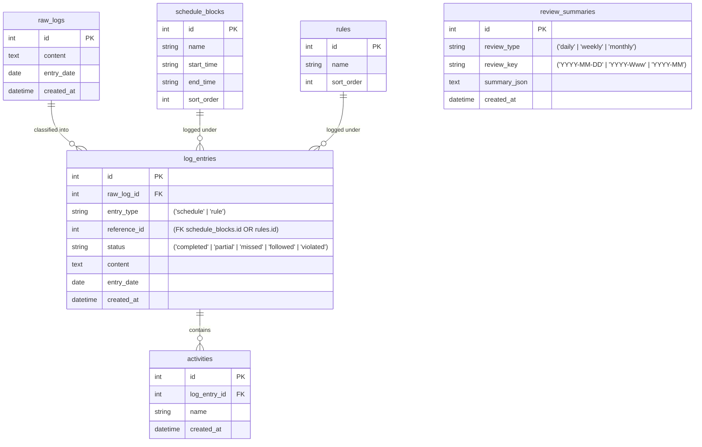
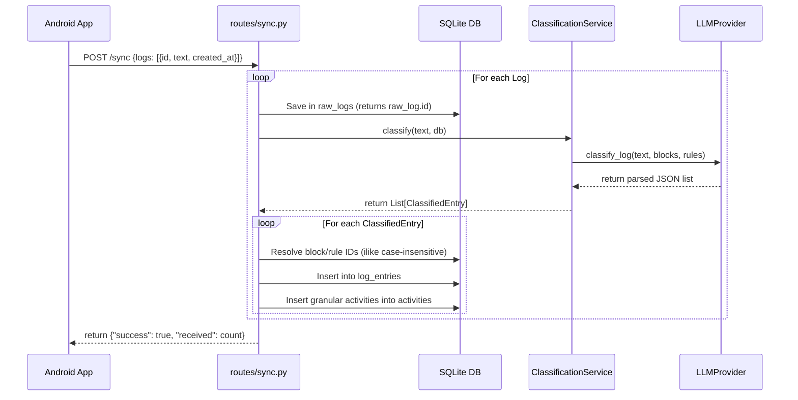

# 📓 Morpheus — Complete Architecture & Developer Onboarding Documentation

Welcome to **Morpheus**, an offline-first journal logging and productivity companion application. 

This document serves as the master onboarding guide for new engineers. After reading this guide, you should be fully equipped to develop features, debug issues, compile the Android application, and manage the backend service without needing to comb through raw code.

---

## 🚀 1. System Overview & Core Concept

Morpheus helps users track daily schedule block execution and compliance with personal rules. It operates on a **local-first, companion-sync model**:
1. **Offline Capture**: The user records natural language journal entries (e.g., *"I did jogging at 6 AM, followed sleep schedule, but missed morning routine"*) on their mobile device, even when disconnected.
2. **Local DB Store**: Mobile logs are saved to a local SQLite database on the device.
3. **Wi-Fi Sync**: When connected to the same local network as the user's laptop, logs are synced to the FastAPI server.
4. **AI Classification & Parsing**: The backend server processes natural language log entries using an LLM (Gemini or OpenRouter), mapping sentences to specific schedules or rules and extracting individual activities.
5. **AI Productivity Coach**: The backend periodically compiles stats and queries the LLM to generate structured daily, weekly, or monthly review coach assessments.

---

## 🛠️ 2. Technology Stack

### Backend Service (Laptop/Server)
*   **Web Framework**: FastAPI (running on Uvicorn)
*   **Database Engine**: SQLite (local database file `morpheus.db`)
*   **Object-Relational Mapping (ORM)**: SQLAlchemy 2.0 (using type-annotated `Mapped` style)
*   **Template Engine**: Jinja2 (server-rendered templates for the web dashboard)
*   **AI Integration**: 
    *   **Google Gemini**: Unified `google-genai` SDK targeting `gemini-2.0-flash`.
    *   **OpenRouter**: Synced HTTP completions client targeting `openai/gpt-oss-120b` (or other config models).

### Companion App (Mobile)
*   **Development Platform**: Native Android (Kotlin, Jetpack Compose)
*   **Build System**: Gradle Kotlin DSL (`build.gradle.kts`) with Version Catalogs (`libs.versions.toml`)
*   **Target SDK**: Compile SDK `36`, Target SDK `36`, Minimum SDK `24` (Android 7.0)
*   **Database**: Custom Android SQLite Helper (`android.database.sqlite.SQLiteOpenHelper`)
*   **Network Client**: Standard Java `HttpURLConnection` on `Dispatchers.IO` to ensure lightweight runtime overhead and high reliability over local networks.

---

## 📂 3. Directory Structure

```
Morpheus/
├── requirements.txt                 # Python dependencies
├── morpheus.db                      # Local SQLite file (generated at startup)
├── .env                             # Environment configuration (ignored by git)
├── .env.example                     # Reference template for configuration
├── app/                             # Backend source folder
│   ├── main.py                      # Application entrypoint & startup routing
│   ├── config/
│   │   └── settings.py              # Pydantic Settings validation
│   ├── database/
│   │   ├── base.py                  # Declarative SQLAlchemy base class
│   │   ├── engine.py                # Connection pool & DB initialization helper
│   │   └── seed.py                  # Initial schedule blocks & rules seeding logic
│   ├── models/                      # SQLAlchemy ORM Models
│   │   ├── schedule_block.py        # Loggable schedule blocks (Sleep, Deep Work, etc.)
│   │   ├── rule.py                  # Loggable compliance rules (No Social Media, etc.)
│   │   ├── raw_log.py               # Raw logs captured offline on mobile
│   │   ├── log_entry.py             # Parsed, structured log entries
│   │   ├── activity.py              # Granular activities extracted from logs
│   │   └── review_summary.py        # Cached AI coach review documents
│   ├── routes/                      # API and Web endpoints
│   │   ├── health.py                # Health checks
│   │   ├── sync.py                  # Sync endpoint from mobile (/sync)
│   │   ├── pages.py                 # HTML Dashboard and Form submissions
│   │   └── reviews.py               # Daily/Weekly/Monthly AI review pages
│   ├── services/                    # Business Logic Layer
│   │   ├── log_service.py           # Log database CRUD operations
│   │   ├── review_service.py        # Date-range statistics aggregation
│   │   ├── review_payload_builder.py # Formatting statistics for LLM prompts
│   │   ├── ai_summary_service.py     # AI analysis caching and orchestrator
│   │   ├── classification_service.py # Core LLM classification orchestrator
│   │   └── llm/                     # LLM Provider Layer
│   │       ├── llm_base.py          # Abstract provider base class
│   │       ├── gemini_provider.py   # Concrete Gemini integration
│   │       └── openrouter_provider.py # Concrete OpenRouter integration
│   ├── static/css/style.css         # Dark theme style sheet
│   └── templates/                   # Server-rendered Jinja2 HTML files
│
└── morpheus-capture/                # Android Companion App
    ├── build.gradle.kts             # Project root build script
    ├── settings.gradle.kts          # Gradle build and repository settings
    ├── gradle/libs.versions.toml    # Android version management catalog
    └── app/                         # App module source folder
        ├── build.gradle.kts         # Android compiler configuration
        └── src/main/
            ├── AndroidManifest.xml  # Cleartext network permissions & settings
            └── java/com/example/morpheuscapture/
                ├── MainActivity.kt  # Root Activity entrypoint
                ├── Navigation.kt    # Composition destination router
                ├── NavigationKeys.kt# Screen destination identifiers
                ├── theme/           # Compose neon-dark theme colors
                ├── data/            # Local data access models
                │   ├── LogItem.kt   # Local log data representation class
                │   ├── DatabaseHelper.kt # SQLite table manager
                │   └── DataRepository.kt # Offline storage & HTTP client
                └── ui/main/         # Presentation Layer
                    ├── MainScreen.kt# Tabs (Capture & Sync) layouts
                    └── MainScreenViewModel.kt # Composable UI state controller
```

---

## 🗄️ 4. Database Architecture & Schema

The backend uses a local SQLite database containing six related tables. It initializes automatically on application startup.



### Table Definitions & Seeding defaults

#### 1. `raw_logs`
Stores the raw, unprocessed strings submitted by the user. Logs arriving from mobile are saved here before passing to the AI pipeline.

#### 2. `schedule_blocks`
Predefined daily schedule intervals. Defaults include:
1. **Sleep** (10:00 PM - 6:00 AM)
2. **Jogging** (6:00 AM - 6:30 AM)
3. **Morning Routine** (6:30 AM - 7:00 AM)
4. **Morning Study** (7:00 AM - 7:50 AM)
5. **Travel + Breakfast** (7:50 AM - 8:45 AM)
6. **Office Morning Study** (8:45 AM - 10:40 AM)
7. **Deep Work** (10:40 AM - 1:00 PM)
8. **Lunch** (1:00 PM - 2:00 PM)
9. **Afternoon Work** (2:00 PM - 4:30 PM)
10. **Office Evening Study** (4:30 PM - 6:00 PM)
11. **Evening Routine** (6:00 PM - 8:00 PM)
12. **Night Study** (8:00 PM - 10:00 PM)

#### 3. `rules`
Daily rules to evaluate compliance against:
1. **No Social Media**
2. **Study time >= 4 hours**
3. **Deep Work >= 2 hours**

#### 4. `log_entries`
The structured output from LLM log parsing. Linkages relate this entry back to the source schedule block/rule and the source `raw_logs` row.
> [!IMPORTANT]
> Morpheus queries and evaluates reviews strictly using `entry_date` (the calendar date the log represents) rather than `created_at`. This supports retroactive journaling for previous days.

#### 5. `activities`
Granular task items extracted by the LLM from schedule blocks (e.g., parsing *"I did Jogging at 6 AM"* extracts *"Jogging at 6 AM"* as an activity name).

#### 6. `review_summaries`
Maintains a cache of AI review analysis JSON objects. A unique constraint on `(review_type, review_key)` ensures AI is not repeatedly called for the same period.

---

## ⚙️ 5. Backend Execution Flows & API

### A. Mobile Log Synchronization Flow (`POST /sync`)
The mobile application synchronizes its capture history using the JSON endpoint `/sync`.



### B. AI Review Analysis Flow
When the user visits a review page (Daily/Weekly/Monthly):
1. **Aggregation**: `review_service.py` runs queries to compile completed, partial, missed, followed, and violated counts.
2. **Cache Check**: `ai_summary_service.py` queries `review_summaries` using a calculated period key (e.g. `2026-06-21`, `2026-W25`, or `2026-06`).
    * **Cache Hit**: Instantly deserializes the JSON string and renders the summary view.
    * **Cache Miss**: Serializes the period statistics, builds an LLM prompt, requests structured JSON from the active `LLMProvider`, caches it in the database, and renders it.
3. **Empty Graceful Fallback**: If the statistics show no activities were logged in the period, the LLM call is bypassed and a default card is displayed, saving API costs and avoiding errors.

---

## 🤖 6. LLM Provider Layer & Error Robustness

Morpheus abstracts LLM providers under the contract interface `LLMProvider` located in `app/services/llm/llm_base.py`.

### A. Gemini Provider (`gemini_provider.py`)
Uses the unified `google-genai` SDK and structured schemas:
*   Enforces structure output parameters (`response_schema=ClassificationResult` / `response_schema=ReviewAnalysis`).
*   Ensures 100% compliant JSON responses directly from the Gemini API.

### B. OpenRouter Provider (`openrouter_provider.py`)
Uses `httpx.post` to communicate with OpenRouter's completions endpoint:
*   Configured Model: `openai/gpt-oss-120b`.
*   Includes fallback text cleaning (`_parse_json_content`) to remove markdown fences (e.g., ` ```json ` wrapper) and trailing commas generated by models that fail strict JSON mode constraints.

### C. JSON Parsing Safety & DB Session Protection
> [!WARNING]
> LLM providers are prone to intermittent network drops, rate limits, or HTML gateway timeouts (502 / 504 errors). If the raw API response is HTML instead of JSON, calls to `response.json()` will throw errors.
*   Both providers execute `response.json()` inside `try-except` blocks.
*   If JSON decoding fails, they log the raw HTTP status code and response body (HTML/error text) to the console and return `None` safely.
*   This protects the FastAPI route handler from throwing unhandled exceptions, meaning that the parent transaction is committed successfully. Even if an LLM classification fails, the raw log is preserved in the database for later processing.

---

## 📱 7. Android App Architecture (`morpheus-capture`)

The native companion application is a lightweight, local-first Compose application.

### A. Offline Storage Layer
*   **DatabaseHelper.kt**: Creates a local SQLite database `morpheus_capture.db` with a table `logs`:
    ```sql
    CREATE TABLE logs (
        id TEXT PRIMARY KEY,
        text TEXT NOT NULL,
        created_at TEXT NOT NULL,
        synced INTEGER DEFAULT 0
    )
    ```
*   **DataRepository.kt**: Handles logging CRUD:
    *   Saves logs offline and updates state flows (`allLogs`, `unsyncedCount`).
    *   `syncLogs(serverUrl)`: Collects unsynced logs, constructs a `POST /sync` request on `Dispatchers.IO` using a standard `HttpURLConnection`, parses response confirmation, and marks local records as synced (`synced = 1`) on success.
    *   **Generous Timeouts**: Connection timeout is set to **15,000ms** and Read timeout to **60,000ms** to ensure slow Wi-Fi connections or long LLM classification processing times on the laptop do not terminate the sync prematurely.

### B. Presentation & Theme Layer
*   **MVVM ViewModels**: `MainScreenViewModel.kt` handles input state, tags, UI history updates, and sync actions.
*   **Theme Layout**: Configured with a premium dark neon theme:
    *   Primary Color: Charcoal-slate dark surface.
    *   Accent Colors: Neon purple and neon cyan buttons/borders.
*   **Compose MainScreen.kt**: Employs a dual-tab screen:
    1.  **Capture Tab**: Text inputs, suggestion chips for quick template tagging (e.g., *Jogging*, *Deep Work*, *Routine*), and a scrolling card list of logged history showing colored badge sync statuses (Synced/Local).
    2.  **Sync Tab**: URL input field (saved persistently using Android's `SharedPreferences`), validation warnings, progress indicator, and the sync action trigger.

---

## 🛠️ 8. Developer Quickstart & Compilation

Follow these steps to run and compile both parts of the project:

### Backend Development Startup

1.  **Setup Virtual Environment**:
    ```powershell
    python -m venv venv
    .\venv\Scripts\Activate.ps1
    ```
2.  **Install dependencies**:
    ```powershell
    pip install -r requirements.txt
    ```
3.  **Setup Environment Variables**:
    Create a file named `.env` in the project root:
    ```env
    APP_NAME=Morpheus
    DEBUG=True
    LLM_PROVIDER="openrouter"
    OPENROUTER_API_KEY="your-openrouter-key"
    OPENROUTER_MODEL="openai/gpt-oss-120b"
    GEMINI_API_KEY="your-gemini-key"
    ```
4.  **Run backend**:
    ```powershell
    uvicorn app.main:app --host 0.0.0.0 --port 8000 --reload
    ```
    *Open `http://localhost:8000` in your browser. The database seeds are initialized automatically.*

### Android App Compilation

To compile a debug APK on your machine:
1.  Verify you have JDK installed (e.g., JDK 26.0.1 or JDK 17).
2.  Navigate to the Android project folder:
    ```powershell
    cd morpheus-capture
    ```
3.  Run the Gradle build command:
    ```powershell
    .\gradlew.bat assembleDebug
    ```
4.  The compiled APK will be output at:
    `morpheus-capture\app\build\outputs\apk\debug\app-debug.apk`
5.  Transfer and install `app-debug.apk` onto your phone. Connect your phone to the same local Wi-Fi, open the sync settings tab in the app, type in the server URL (e.g., `http://192.168.x.x:8000`), and trigger your first synchronization sync!
