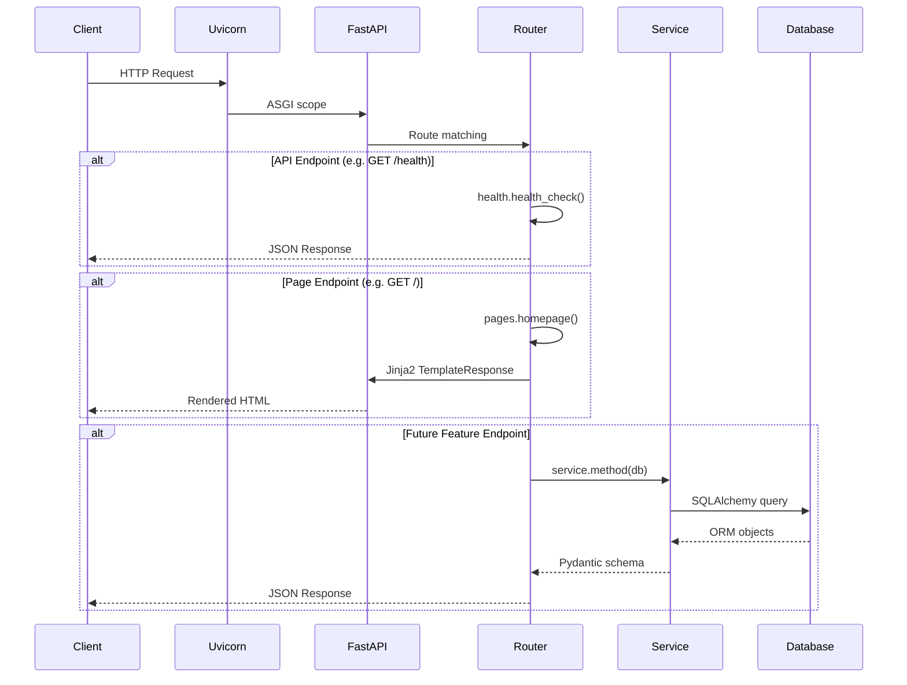
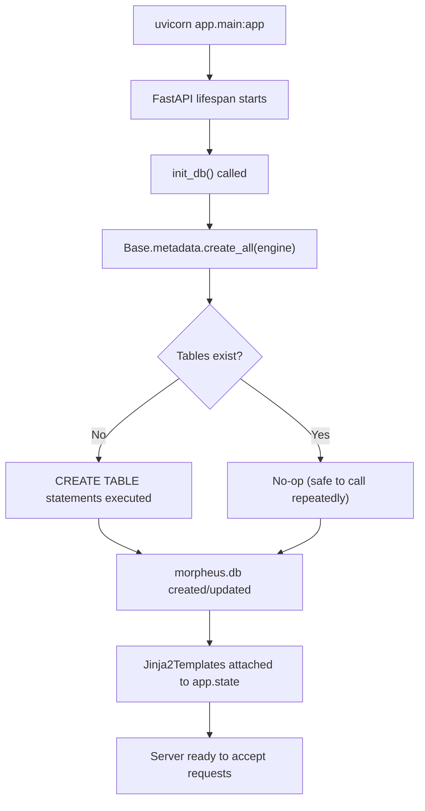
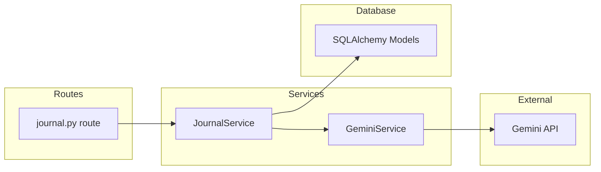

# 🌙 Morpheus — Project Setup Walkthrough

## Folder Structure

```
Morpheus/
├── app/                          # All application code lives here
│   ├── __init__.py               # Marks `app` as a Python package
│   ├── main.py                   # FastAPI app factory — startup, routing, static/templates
│   │
│   ├── config/                   # Configuration layer
│   │   ├── __init__.py           # Re-exports Settings & get_settings()
│   │   └── settings.py           # pydantic-settings model, reads .env
│   │
│   ├── database/                 # Database layer
│   │   ├── __init__.py           # Re-exports Base, get_db, init_db
│   │   ├── base.py               # SQLAlchemy DeclarativeBase (prevents circular imports)
│   │   └── engine.py             # Engine, SessionLocal factory, get_db dependency, init_db
│   │
│   ├── models/                   # ORM models (one file per table)
│   │   └── __init__.py           # Import models here so Base.metadata discovers them
│   │
│   ├── schemas/                  # Pydantic request/response DTOs
│   │   ├── __init__.py           # Re-exports schemas
│   │   └── health.py             # HealthResponse schema
│   │
│   ├── services/                 # Business logic layer
│   │   └── __init__.py           # Guidance for future services
│   │
│   ├── routes/                   # API & page route modules
│   │   ├── __init__.py           # Router registration convention docs
│   │   ├── health.py             # GET /health endpoint
│   │   └── pages.py              # GET / (Jinja2 homepage)
│   │
│   ├── templates/                # Jinja2 HTML templates
│   │   ├── base.html             # Master layout (header, nav, footer)
│   │   └── index.html            # Homepage (extends base.html)
│   │
│   └── static/                   # Static assets served at /static/
│       └── css/
│           └── style.css         # Global design system (dark mode, glassmorphism)
│
├── .env                          # Local environment variables (git-ignored)
├── .env.example                  # Commitable template for .env
├── .gitignore                    # Ignores venv, .env, *.db, __pycache__
├── requirements.txt              # Pinned Python dependencies
├── morpheus.db                   # SQLite database (auto-created at startup)
└── README.md                     # Quick-start instructions
```

---

## Every File and Why It Exists

### Project Root

| File | Purpose |
|------|---------|
| [.env](file:///d:/PlayGround/Morpheus/.env) | Stores environment-specific secrets and settings. Git-ignored so credentials never leak. |
| [.env.example](file:///d:/PlayGround/Morpheus/.env.example) | Commitable template showing which env vars exist, without real values. |
| [.gitignore](file:///d:/PlayGround/Morpheus/.gitignore) | Prevents `venv/`, `.env`, `*.db`, and `__pycache__/` from entering version control. |
| [requirements.txt](file:///d:/PlayGround/Morpheus/requirements.txt) | Declares all Python dependencies with version ranges. |
| [README.md](file:///d:/PlayGround/Morpheus/README.md) | Quick-start guide and project overview for new contributors. |

---

### Configuration Layer

| File | Purpose |
|------|---------|
| [settings.py](file:///d:/PlayGround/Morpheus/app/config/settings.py) | Single source of truth for all app config. Uses `pydantic-settings` to validate env vars at startup. `get_settings()` returns a cached singleton. |

> [!TIP]
> To add a new config value (e.g. `JOURNAL_MAX_LENGTH`), just add a field to the `Settings` class. It will automatically be read from `.env` or the environment.

---

### Database Layer

| File | Purpose |
|------|---------|
| [base.py](file:///d:/PlayGround/Morpheus/app/database/base.py) | Defines `Base` (SQLAlchemy `DeclarativeBase`). Lives in its own file to prevent circular imports between models and engine. |
| [engine.py](file:///d:/PlayGround/Morpheus/app/database/engine.py) | Creates the SQLAlchemy `Engine`, `SessionLocal` factory, `get_db()` FastAPI dependency, and `init_db()` for table creation. |

> [!IMPORTANT]
> `Base` is deliberately in a separate file. Models import `Base` from `base.py`, and `engine.py` imports `Base.metadata`. If both were in one file, models and engine would circularly depend on each other.

---

### Models, Schemas, Services

| File | Purpose |
|------|---------|
| [models/__init__.py](file:///d:/PlayGround/Morpheus/app/models/__init__.py) | Future ORM models go here (e.g. `JournalEntry`, `Rule`, `Schedule`). Import them in `__init__.py` so `Base.metadata` discovers them before `init_db()`. |
| [schemas/health.py](file:///d:/PlayGround/Morpheus/app/schemas/health.py) | Pydantic DTO for the `/health` response. Schemas define the API contract independently of the database schema. |
| [services/__init__.py](file:///d:/PlayGround/Morpheus/app/services/__init__.py) | Placeholder for the business-logic layer. Services sit between routes (thin controllers) and models (data access). |

---

### Routes

| File | Purpose |
|------|---------|
| [health.py](file:///d:/PlayGround/Morpheus/app/routes/health.py) | `GET /health` → returns `{"status": "ok"}`. Used by monitoring, CI, and load balancers. |
| [pages.py](file:///d:/PlayGround/Morpheus/app/routes/pages.py) | `GET /` → renders `index.html` via Jinja2. All server-rendered page routes live here. |

---

### Templates & Static Assets

| File | Purpose |
|------|---------|
| [base.html](file:///d:/PlayGround/Morpheus/app/templates/base.html) | Master layout: `<head>`, Google Fonts, CSS link, header/nav, ``, footer. |
| [index.html](file:///d:/PlayGround/Morpheus/app/templates/index.html) | Homepage — extends `base.html`, shows hero section and feature preview cards. |
| [style.css](file:///d:/PlayGround/Morpheus/app/static/css/style.css) | Full design system: CSS custom properties, dark palette, glassmorphism cards, micro-animations, responsive breakpoints. |

---

### Application Entry Point

| File | Purpose |
|------|---------|
| [main.py](file:///d:/PlayGround/Morpheus/app/main.py) | **The central wiring file.** Creates the `FastAPI` instance, registers the lifespan (startup/shutdown), mounts static files, attaches Jinja2 templates, and includes all route modules. |

---

## Request Flow



**Step-by-step for `GET /`:**

1. Uvicorn receives the HTTP request and hands it to FastAPI.
2. FastAPI matches the path `/` to `pages.router`.
3. `pages.homepage()` is invoked with the `Request` object.
4. The function calls `request.app.state.templates.TemplateResponse(...)`, passing template variables.
5. Jinja2 renders `index.html` (which extends `base.html`) and returns full HTML.
6. The HTML response is sent back through Uvicorn to the client.

---

## Database Initialization Flow



**Key points:**

- `init_db()` runs inside the FastAPI `lifespan` context manager at server startup.
- It calls `Base.metadata.create_all(bind=engine)` which is idempotent — existing tables are untouched.
- The SQLite file (`morpheus.db`) is created automatically at the project root.
- For production schema migrations, replace `create_all` with **Alembic**.

---

## How Future Gemini API Integration Should Fit

The architecture is already prepared for Gemini. Here's the recommended integration pattern:



### Recommended steps:

1. **Add `GEMINI_API_KEY`** to `.env` (placeholder already exists in [settings.py](file:///d:/PlayGround/Morpheus/app/config/settings.py)).

2. **Create `app/services/gemini_service.py`** — a thin wrapper around the `google-generativeai` SDK:
   ```python
   # app/services/gemini_service.py
   import google.generativeai as genai
   from app.config import get_settings

   class GeminiService:
       def __init__(self):
           genai.configure(api_key=get_settings().GEMINI_API_KEY)
           self.model = genai.GenerativeModel("gemini-pro")

       def evaluate_compliance(self, entry_text: str, rules: list[str]) -> dict:
           prompt = f"Evaluate this journal entry against these rules: ..."
           response = self.model.generate_content(prompt)
           return {"evaluation": response.text}
   ```

3. **Create `app/services/journal_service.py`** — orchestrates between the DB and Gemini:
   ```python
   class JournalService:
       def __init__(self, db: Session, gemini: GeminiService):
           self.db = db
           self.gemini = gemini

       def create_and_evaluate(self, payload: JournalCreate) -> JournalEntry:
           entry = JournalEntry(**payload.dict())
           self.db.add(entry)
           self.db.commit()
           evaluation = self.gemini.evaluate_compliance(entry.content, ...)
           return entry
   ```

4. **Create routes** in `app/routes/journal.py` and register in `main.py`.

> [!NOTE]
> The services layer is the key architectural decision. Routes stay thin (validate input, call service, return result). Services own all business logic. This makes Gemini calls testable and swappable.

---

## Verification Results

| Test | Result |
|------|--------|
| `GET /health` | ✅ Returns `{"status": "ok"}` |
| `GET /` | ✅ Returns 200, renders homepage HTML |
| Static CSS served | ✅ `/static/css/style.css` returns 200 |
| SQLite auto-created | ✅ `morpheus.db` created at startup |
| Database init (tables) | ✅ `CREATE TABLE` runs on first startup |

---

## How to Run

```bash
cd d:\PlayGround\Morpheus
venv\Scripts\activate
uvicorn app.main:app --reload
```

Then visit:
- **Homepage:** [http://localhost:8000](http://localhost:8000)
- **Health check:** [http://localhost:8000/health](http://localhost:8000/health)
- **API docs:** [http://localhost:8000/docs](http://localhost:8000/docs)
